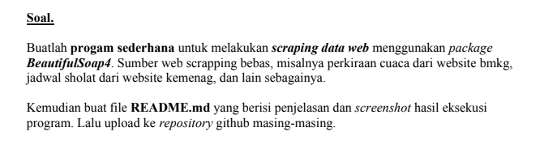
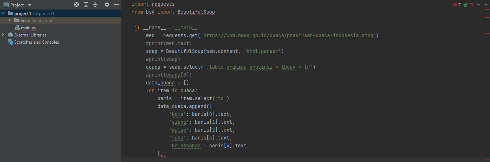
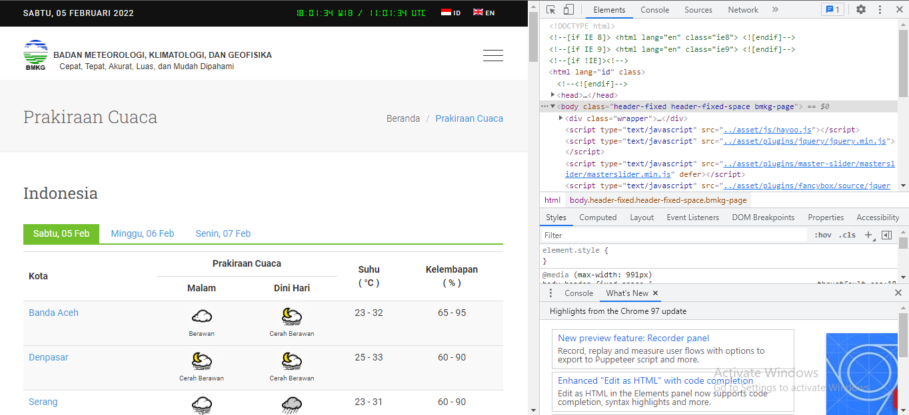

# uas_susulan

## Berikut ini adalah penjelasannya
* Web scraping adalah proses pengambilan data atau esktraksi dari sebuah website, lalu data tersebut umumnya disimpan dalam sebuah format tertentu.
* Beautifulsoup4 adalah module untuk digunakan proses scraping dan request adalah module http untuk melakukan proses mengambil data.

## Berikut codingannya

## Berikut sumber web yang saya gunakan

## Sekian dan terima kasih
* Mohon maaf pak, karena saya belum paham jadi saya mengerjakanya sebisa saya aja pak. Dan ini pun belum selesai semuanya mohon maaf pak sekali lagi :)
